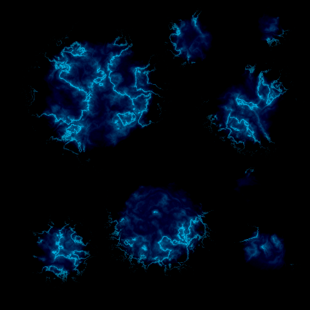
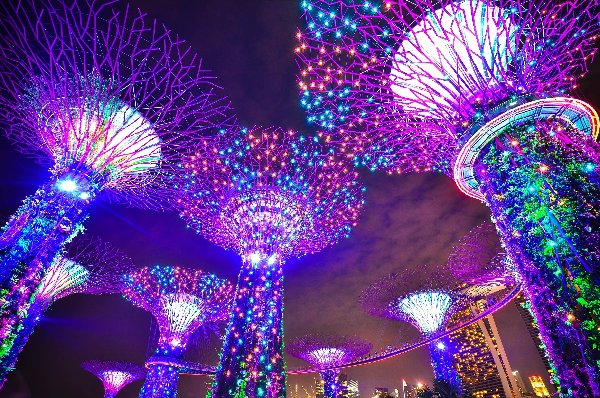

<html>
  <h1>Image-processor</h1>
  
An image processing program that is able to manipulate individual image pixels in .tga image files to change specific color channels and combine images together, in addition to being able to apply Multiply, Subtract, Add, and Overlay blending modes as specified <a href="http://www.simplefilter.de/en/basics/mixmods.html">here</a>. 

  <h3>Multiply blending mode</h3>
  
  <h3>Combining the RGB color channels from three different images</h3>
  
  <h3>180 degree rotation</h3>
  
</html>
